# mkdocs-with-pdf

[mkdocs-with-pdf](https://github.com/orzih/mkdocs-with-pdf)を使用して、ドキュメントをPDFとして出力することができます。


## 環境構築

WeasyPrintに依存してるので、事前に環境構築が必要。

https://doc.courtbouillon.org/weasyprint/latest/first_steps.html#linux

インストールする。

```
pip install mkdocs-with-pdf
```

プラグインを有効にする。

```yaml
plugins:
    - with-pdf
```


## 表紙をつける

```yaml
plugins:
    - with-pdf:
        cover: true
        cover_title: My Docs
```

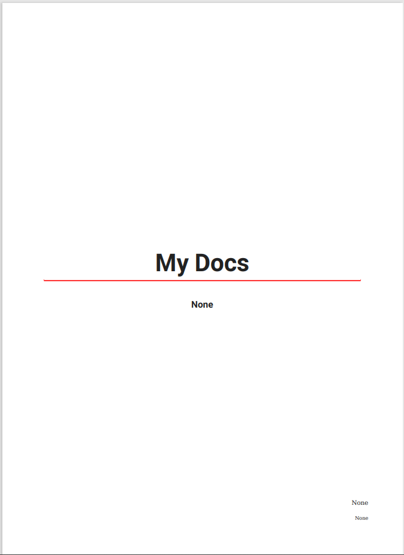


## 表紙をカスタマイズする

表紙用のHTMLを差し込むことができます。  
custom_template_pathで指定したディレクトリー内に、`cover.html`を配置します。

```yaml
plugins:
    - with-pdf:
        cover: true
        custom_template_path: custom_template
```

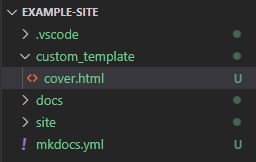

```html
<!-- 表紙 -->
<div style="background-color: steelblue; padding: 0.5em;">
    <h1 style="color: white;">MKDoc</h1>
</div>
```

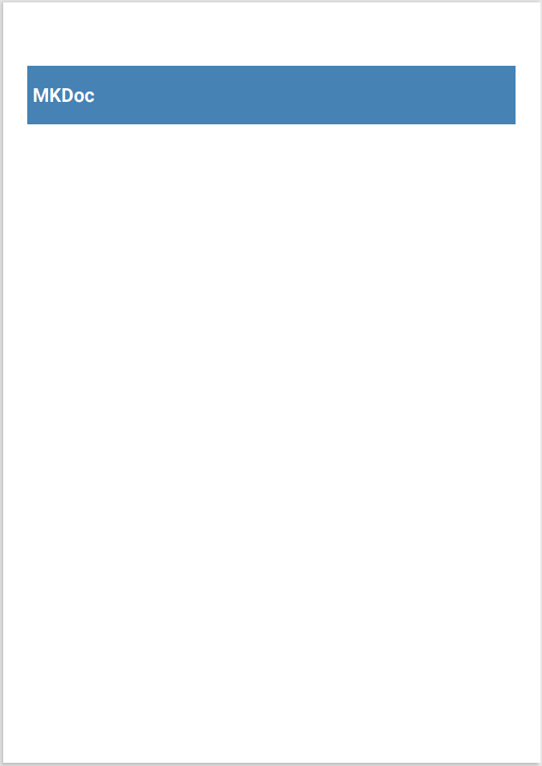


デフォルトで余白が設定されているので、帯状に塗りつぶしたい場合、`margin`をマイナスに設定して描画領域を調整します。

```html
<!-- 表紙 -->
<div style="background-color: steelblue; padding: 0.5em 0.5em 0.5em 3.5em; margin: 0 -3em;">
    <h1 style="color: white;">MKDocs</h1>
</div>
```

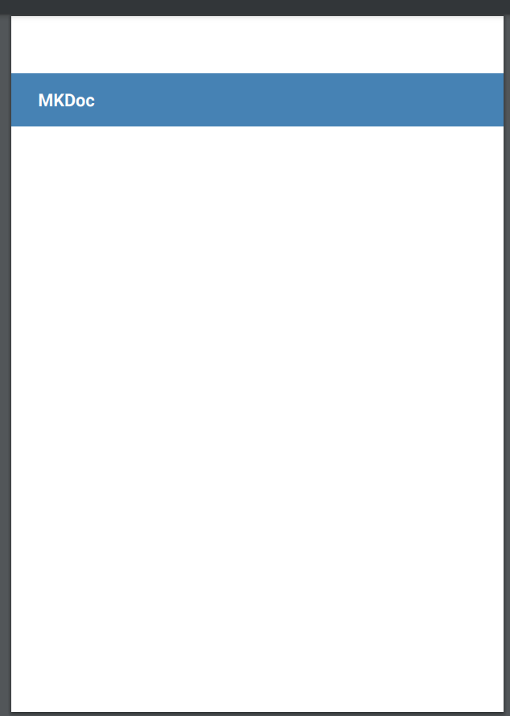


## 表紙の次に注意書き等のページを差し込む

cover.html 内で改ページを指定することで、2ページ以降にも任意のページを差し込むことができます。

```html
<!-- 表紙 -->
<div style="background-color: steelblue; padding: 0.5em 0.5em 0.5em 3.5em; margin: 0 -3em;">
    <h1 style="color: white;">MKDocs</h1>
</div>

<!-- 注意書き -->
<div style="page-break-before: always;">
    <h1>はじめに</h1>
    <span>注意書き等～～～～～</span>
</div>
```

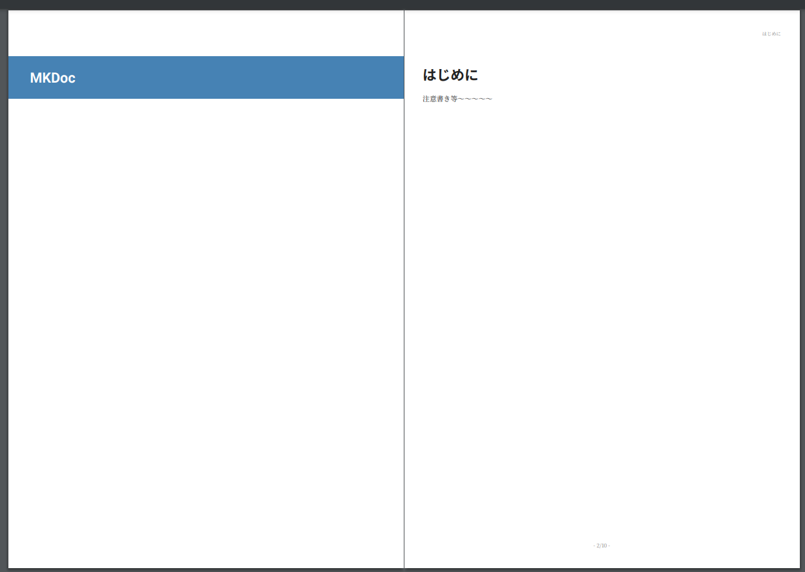


## PDF出力用のスタイルシートを指定する
 
custom_template_pathで指定したディレクトリー内に、`styles.scss`を配置します。

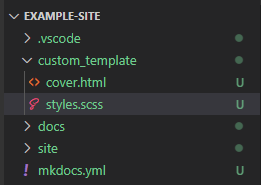


## 見出しのボーダーカラーを変更する

テーマを指定するようなオプションはないので、styles.scss内でスタイルを指定します。

```scss
$mainColor: #177e7e;
$subColor: rgba($mainColor, 0.85);

article {
    h1 {
        border-bottom: 2px solid $mainColor !important;
    }
    h2 {
        border-bottom: 1px solid $subColor !important;
    }
    h3 {
        border-bottom: 0.5px solid #eee;
    }
    h1>.pdf-order,
    h2>.pdf-order,
    h3>.pdf-order {
        padding-left: 6px;
    }
}

.pdf-order {
    color: $mainColor !important;
}
```

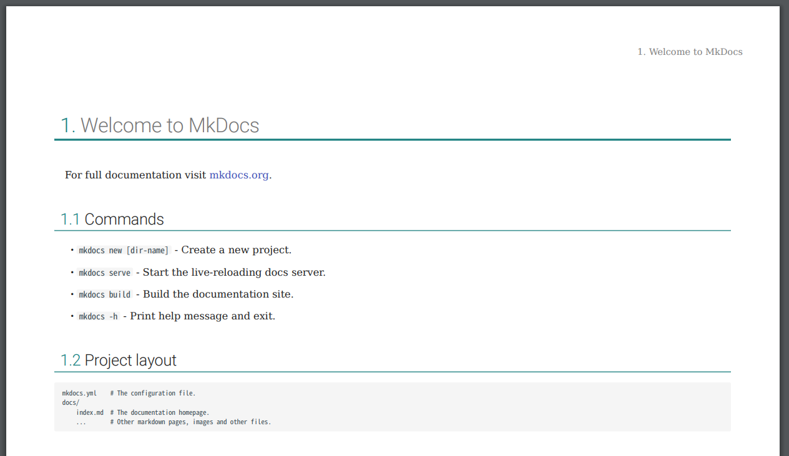


## 目次へ出力する見出しレベルを指定する

目次へ出力する見出しのレベルを指定することができます。

```yaml
plugins:
    - with-pdf:
        toc_level: 3
```

`toc_level: 3`にすることで、見出しレベルが３（`###`）の項まで目次へ出力されます。

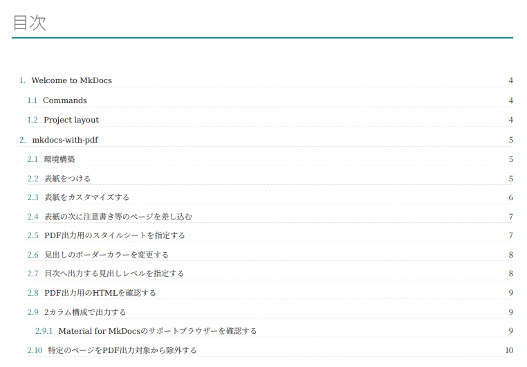


## PDF出力用のHTMLを確認する

スタイルを拡張する際、要素の構造や、属性等確認したい場合があります。
オプションを`debug_html: true`とすることで、PDF出力用のHTMLがログ出力されるようになります。

```yaml
plugins:
    - with-pdf:
        debug_html: true
```

pretty-print等のオプションはないので、htmlとして書き出し、フォーマットをかけて確認するとわかりやすいです。

```
mkdocs build > debug_pdf_print.html
```

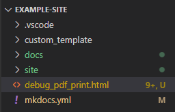

見出しへ付与されたアンカーを確認したい場合は、`show_anchors: true`とすることで、ログへ一覧が出力されます。

```yaml
plugins:
    - with-pdf:
        show_anchors: true
```

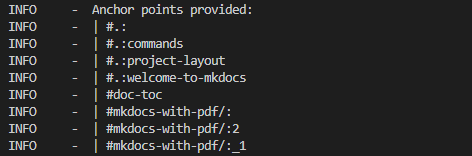


## 2カラム構成で出力する

２カラム構成で出力する見出しレベルを指定することで、そのレベル以下は２カラムで出力されるようになります。

```yaml
plugins:
    - with-pdf:
      two_columns_level: 3
```


### Material for MkDocsのサポートブラウザーを確認する

この項は、見出しレベルが３（`###`）なので、２カラム構成で出力されます。

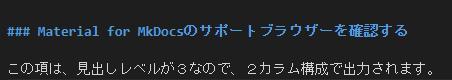

---

Material for MkDocsの製品サイトへアクセスします。


<div class="triangle"></div>

Getting startedをクリックします。


<div class="triangle"></div>

左側のメニューからBrowser supportへ移動します。

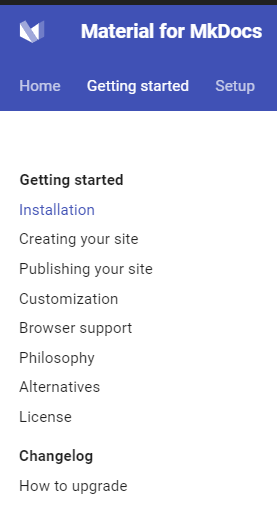

<div class="triangle"></div>

対応ブラウザーと各バージョンを確認します。

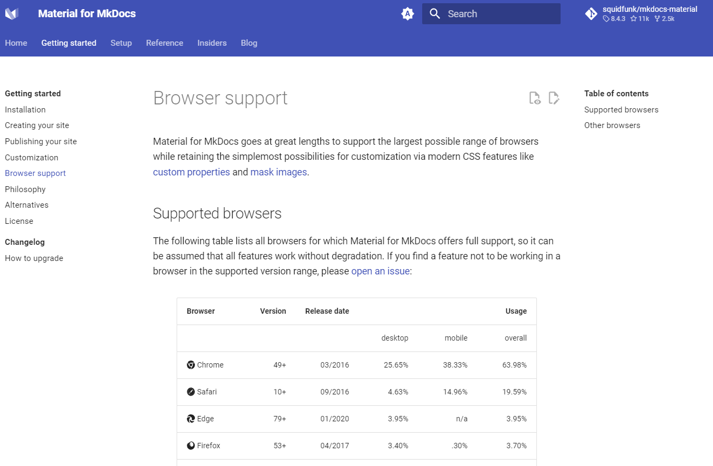

---

こんな感じのちょっとしたフローは２カラム構成のほうが無駄なスペースを消費せず見やすい。


## ２カラム構成 カラム間にラインを引く

カラム間にラインを引きたい場合は、`column-rule`を指定します。

```css
section.two-columns {
    column-rule: solid 1px #eee;
}
```


## 特定のページをPDF出力対象から除外する

オプションで、除外したいファイル/ディレクトリを指定します。

MkDocsのオプションで`use_directory_urls: false`としている場合

```yaml
plugins:
    - with-pdf:
      exclude_pages:
       - 'mkdocks-with-pdf-output.html'
```

MkDocsのオプションで`use_directory_urls: true`としている場合

```yaml
plugins:
    - with-pdf:
      exclude_pages:
       - 'mkdocks-with-pdf-output/'
```


## 各ページにロゴを表示する

特にオプションはないので、スタイルで指定します。
[CSS Paged Media Module Level 3](https://drafts.csswg.org/css-page/#at-page-rule)  
styles.scss
```scss

@page:first {
    @top-left {
        content: '';
    }
}

@page {
    @top-left {
        opacity: .6;
        transform: translateX(-150px) scale(0.3);
        content: url(data:image/png;base64,・・・・・);
    }
}

```

表紙をのぞいた各ページの左上にロゴが表示されます。


## 裏表紙をつける・カスタマイズする

裏表紙用のHTMLを差し込むことができます。  
オプションで`back_cover: true`を設定し、custom_template_pathで指定したディレクトリー内に、`back_cover.html`を配置します。

```yaml
plugins:
  - with-pdf:
      back_cover: true
      custom_template_path: custom_template
```

back_cover.html
```html
<!-- 裏表紙 -->
<div class="back-cover-page">
</div>
```

不要な情報があればスタイルで無効化します。

styles.scss
```scss
.back-cover-page {
    page: back-page;
    page-break-before: always;
}

@page back-page {
    @top-right {
        content: none;
    }
    @top-left {
        content: none;
    }
    @bottom-center {
        content: none;
    }
    @bottom-right {
        content: none;
    }
}
```

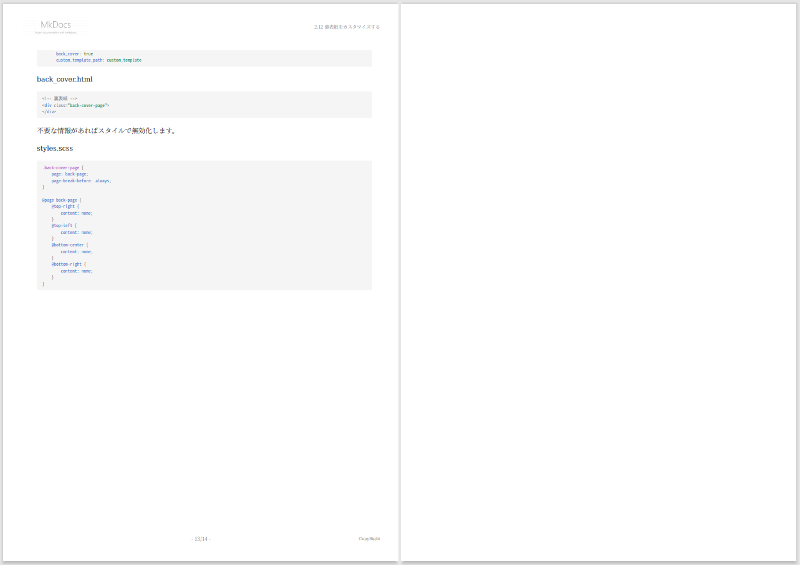


## イベントフック

mkdocs.ymlと同一ディレクトリーに、`pdf_event_hook.py`を配置することで、PDF出力時に処理を拡張することができます。

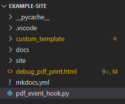

```python
def inject_link(html: str, href: str, page: Page, logger: logging) -> str:

def pre_js_render(soup: BeautifulSoup, logger: logging) -> BeautifulSoup:

def pre_pdf_render(soup: BeautifulSoup, logger: logging) -> BeautifulSoup:
```

pre_pdf_renderを拡張し、PDFとして出力する要素の追加を試してみます。  
以下処理は裏表紙のフッターへ、ビルド時の情報を出力しています。

```python
import logging
import sys
import datetime

from bs4 import BeautifulSoup
from mkdocs.structure.pages import Page

def pre_pdf_render(soup: BeautifulSoup, logger: logging) -> BeautifulSoup:
    logger.info('(hook on pre_pdf_render)')
    
    for el in soup.select('.back-cover-page'):
        logger.info(el)
        
        el_main = soup.new_tag('main')
        el_main['style'] = 'flex: 1;'
        el.append(el_main)

        el_output_info = soup.new_tag('footer')
        el_output_info['style'] = 'color: gray; font-size: 0.9em;'

        # Pythonバージョン
        el_python_version = soup.new_tag('div')
        el_python_version.string = 'Python version: ' + sys.version
        el_output_info.append(el_python_version)

        # 出力日時
        el_current_dt = soup.new_tag('div')
        el_current_dt.string = '出力日時: ' + datetime.datetime.now().strftime('%Y年%m月%d日 %H:%M:%S')
        el_output_info.append(el_current_dt)

        el.append(el_output_info)
        break

    return soup
```

styles.scss
```scss
.back-cover-page {
    page: back-page;
    page-break-before: always;
    height: 100%;
    display: flex;
    flex-flow: column;
}
```

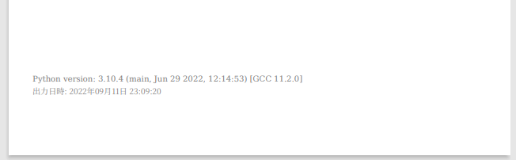